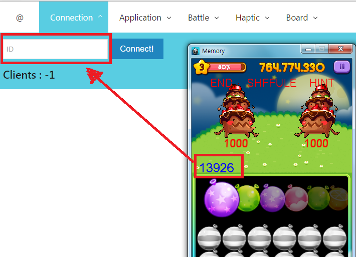
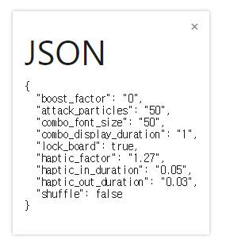

how_to_use
====

클라이언트와 제어판 연결하기
----
* 게임을 구동합니다.
* [제어판 페이지](http://pjc.luavis.kr/memo/)에 접속합니다.
* 게임에 표시된 숫자로 이루어진 아이디를 제어판의 `Connection -> ID` 에 입력합니다.
  
* `Connect` 버튼을 클릭하면 연결됩니다.

메뉴바 이용하기
----
* 제어판의 메뉴 화면에서는 각각의 아이템을 클릭할 수 있습니다.
* 아이템을 클릭하면 아래에 세부적인 제어 메뉴가 표시됩니다.

결과물 출력하기
----
* 메뉴 가장 왼쪽의 `@` 버튼을 클릭하면 json으로 출력이 가능합니다. 

